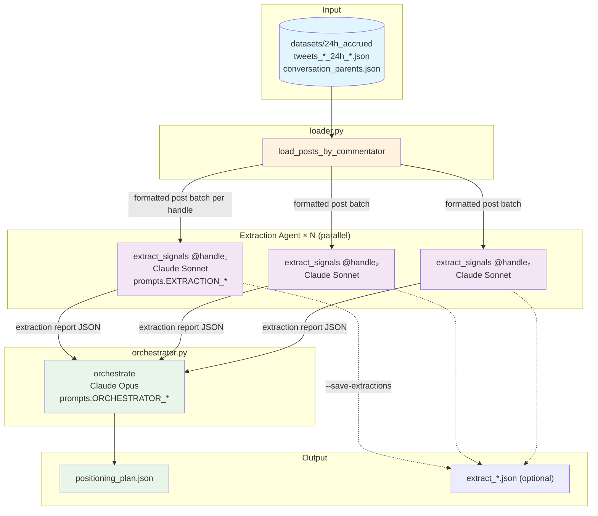

# Market Signal Extraction — Data Pipeline

## Where things live

| What | Location |
|------|----------|
| **Prompts** | `agenti/prompts.py` |
| **Extraction logic** | `agenti/extraction.py` |
| **Orchestrator logic** | `agenti/orchestrator.py` |
| **Loader** | `agenti/loader.py` |
| **CLI** | `agenti/cli.py` |
| **Prompt suite (v2 spec)** | `agenti.md` (canonical spec) |

---

## What goes to Claude

### Stage 1: Extraction Agent (×N, one per commentator)

**Model:** `claude-sonnet-4-20250514`  
**Code:** `extraction.extract_signals(handle, raw_post_data)`

| Message | Content |
|---------|---------|
| **System** | `EXTRACTION_SYSTEM` from `prompts.py` — financial signal extraction instructions + JSON schema |
| **User** | `EXTRACTION_USER_TEMPLATE` with `{{HANDLE}}` → `@clkleinmonaco`, `{{RAW_POST_DATA}}` → formatted posts |

**Raw post format** (from `loader._format_tweet_for_extraction`):
```
[Wed Mar 11 16:49:47 +0000 2026] @nntaleb
@eruditenights CONGRATS Ricky!
Hope for a lifetime of bliss and happiness.
  engagement: 6 likes, 0 RTs, 0 replies, 342 views
  [REPLY TO @eruditenights]: <parent tweet text if reply>

---

[next tweet...]
```

**Output:** JSON extraction report (signals, risk_flags, macro_thesis, fades_and_dismissals, etc.)

---

### Stage 2: Orchestrator Agent (single run)

**Model:** `claude-opus-4-20250514`  
**Code:** `orchestrator.orchestrate(extraction_reports)`

| Message | Content |
|---------|---------|
| **System** | `ORCHESTRATOR_SYSTEM` from `prompts.py` — synthesis principles + positioning plan schema |
| **User** | `ORCHESTRATOR_USER_TEMPLATE` with `{{EXTRACTION_JSONS}}` → JSON array of all extraction reports |

**Output:** JSON positioning plan (theme_map, convergence_matrix, positioning_plan, tail_risk_register, daily_briefing)

---

## Pipeline diagram



---

## Data flow

| Stage | Input | Output |
|-------|-------|--------|
| **Loader** | `tweets_*_24h_*.json`, `conversation_parents.json` (parent_id → tweet for reply context) | `{handle: formatted_post_batch}` — text ready for prompt |
| **Extraction** | Formatted post text per commentator | JSON: signals, risk_flags, macro_thesis, fades_and_dismissals, etc. |
| **Orchestrator** | List of extraction reports (JSON) | JSON: theme_map, convergence_matrix, positioning_plan, daily_briefing |

---

## CLI usage

```bash
# Full pipeline (use python3.11)
python3.11 -m agenti.cli run --dataset datasets/24h_accrued [--commentators 5] [--output out/plan.json]

# Extract one commentator only
python3.11 -m agenti.cli extract --dataset datasets/24h_accrued --handle nntaleb

# Orchestrate from existing extraction files
python3.11 -m agenti.cli orchestrate --extractions out/extract_*.json --output out/plan.json
```
